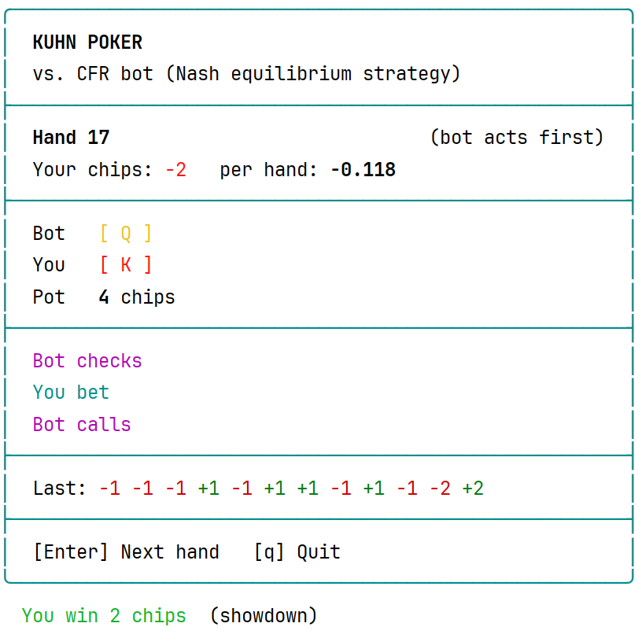
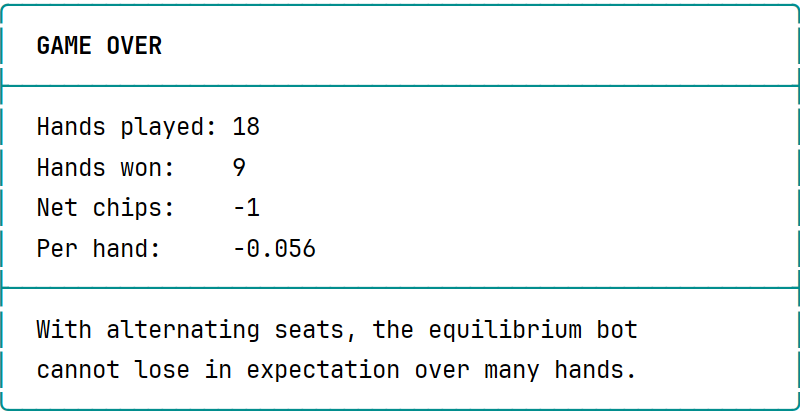

# Kuhn Poker CFR Solver in C++

A from-scratch implementation of **Counterfactual Regret Minimization (CFR)**, the algorithm
behind superhuman poker AIs such as Libratus and Pluribus, applied to **Kuhn Poker**, the
smallest poker game with bluffing and hidden information.

The solver learns a strategy purely through self-play, with no ML libraries, and the result
is verified against the known analytical Nash equilibrium of the game. After training, you
can play against the bot in an interactive terminal game.

This project follows a regret-matching warm-up on Rock-Paper-Scissors, where the same core
idea is applied to a one-shot game.

---

## Screenshot




---

## Kuhn Poker

- The deck has three cards: Jack, Queen, King. Each player antes 1 chip and gets one card.
- Player 1 can **check** or **bet** 1 chip.
- After a check, Player 2 can check (showdown) or bet.
- After a bet, the other player can **fold** or **call** (showdown).
- At showdown the higher card wins the pot.

The game has only 12 decision points (information sets), but it already requires mixed
strategies: to be unexploitable, a player must sometimes bluff with the worst card and
sometimes check with the best one.

---

## How CFR works

1. **Information sets.** A player cannot see the opponent's card, so states that look the
   same to them are grouped into one information set, e.g. *"I hold the Queen and my opponent
   bet after my check"*. The strategy is learned per information set, not per state.
2. **Tree traversal.** Each iteration deals the cards and explores every possible line of
   play recursively. Each decision node's value is the average of its children's values,
   weighted by the current strategy.
3. **Counterfactual regret.** At each node, the regret of an action is how much better it
   would have done than the node's value, weighted by the probability that the **opponent**
   (and chance) led play to that node.
4. **Regret matching.** The next strategy plays each action proportionally to its positive
   cumulative regret.
5. **Average strategy.** The current strategies cycle, but the average strategy, weighted by
   each player's own reach probability, converges to a Nash equilibrium.

---

## Results

After 100,000 iterations, the learned average strategy:

| Player | Card | History | Action 0 | Action 1 |
|--------|------|---------|----------------|---------------|
| P1 | J | –  | check 0.779 | bet 0.221 |
| P1 | Q | –  | check 1.000 | bet 0.000 |
| P1 | K | –  | check 0.332 | bet 0.668 |
| P1 | J | kb | fold 1.000  | call 0.000 |
| P1 | Q | kb | fold 0.447  | call 0.553 |
| P1 | K | kb | fold 0.000  | call 1.000 |
| P2 | J | k  | check 0.668 | bet 0.332 |
| P2 | Q | k  | check 1.000 | bet 0.000 |
| P2 | K | k  | check 0.000 | bet 1.000 |
| P2 | J | b  | fold 1.000  | call 0.000 |
| P2 | Q | b  | fold 0.660  | call 0.340 |
| P2 | K | b  | fold 0.000  | call 1.000 |

`k` = check, `b` = bet. The history is what happened before the decision.

### Comparison with the analytical equilibrium

Kuhn Poker has a family of Nash equilibria parameterized by **α ∈ [0, 1/3]**, the frequency
with which Player 1 bluffs with the Jack. The learned strategy has **α = 0.221**, and the
other probabilities match the relations the theory predicts:

| Quantity | Theory | Learned |
|---|---|---|
| P1 bets with King | 3α = 0.663 | 0.668 |
| P1 calls with Queen after `kb` | α + 1/3 = 0.554 | 0.553 |
| P2 bluffs with Jack after check | 1/3 | 0.332 |
| P2 calls with Queen after bet | 1/3 | 0.340 |
| **Game value for P1** | **−1/18 ≈ −0.0556** | **−0.0556** |

The game value is computed exactly, by evaluating the average strategy on all six possible
deals.

---

## Playing against the bot

After training, the bot plays the average strategy, sampling each action from its
probabilities. Seats alternate every hand, since the game slightly favors the second player.
At showdown the bot's card is revealed, so you can see when it was bluffing.

Because the bot plays an equilibrium strategy, it does not adapt to you, but it also cannot
be exploited: over many hands with alternating seats, its expected result is never negative.

| Situation | Keys |
|---|---|
| No bet to face | `k` check, `b` bet |
| Facing a bet | `f` fold, `c` call |
| After a hand | `Enter` next hand, `q` quit |

---

## Build and run

Requirements: a C++17 compiler and CMake.

```bash
cmake -B build
cmake --build build
./build/KuhnCFR
```

The program trains the solver (under a second), prints the strategy table and game value,
then starts the game.

On Windows, run the executable in **Windows Terminal** for correct colors and box drawing
characters.

---

## Project structure

```
kuhn.h / kuhn.cpp     game rules: terminal histories, current player, legal actions, payoffs
cfr.h / cfr.cpp       CFR solver: information sets, traversal, training, game value
print.h / print.cpp   strategy table and game value output
ui.h                  terminal rendering helpers (colors, boxes)
game.h / game.cpp     interactive game against the trained bot
main.cpp              trains the solver, prints results, starts the game
```

---


## References

- Todd Neller, Marc Lanctot — *An Introduction to Counterfactual Regret Minimization* (2013)
- Zinkevich et al. — *Regret Minimization in Games with Incomplete Information* (2007)
- H. W. Kuhn — *A Simplified Two-Person Poker* (1950)
